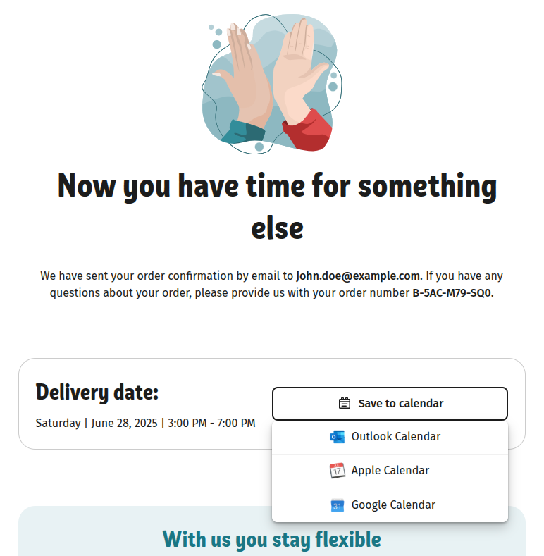
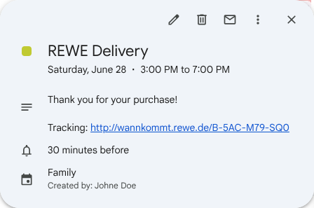

# Chrome Extension: Wannkommtrewe to Calendar Adder

Automatically adds your REWE-tracking URL into calendar invites after completing an order.

When you place an order in the [REWE online shop](https://shop.rewe.de/), the shop already provides calendar links and files for the delivery date. Independent of that, REWE also allows you to track your order via a tracking link (wannkommt.rewe.de), which you are typically sent via SMS shortly before the delivery. This extension automatically adds the tracking link to the calendar invite, so you can easily access it from your calendar app.

> [!TIP]  
> The tracking link in the calendar also enables further automations such as a [HomeAssistant integration](https://github.com/toelke/rewe-lieferung-home-assistant).

Supported calendar apps:
- Google Calendar
- Microsoft Outlook
- Apple Calendar

Supported languages:
- English
- German

## Screenshots

Aftersale page:

Calendar item:

---

Disclaimer: This extension is not affiliated with REWE.
