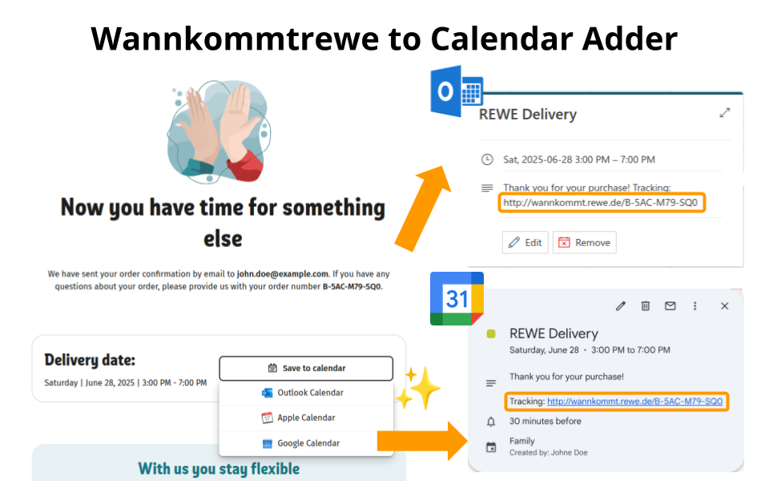

# Browser Extension: Wannkommtrewe to Calendar Adder

Automatically adds your REWE-tracking URL into calendar invites after completing an order.

When you place an order in the [REWE online shop](https://shop.rewe.de/), the shop already provides calendar links and files for the delivery date. Independent of that, REWE also allows you to track your order via a tracking link (wannkommt.rewe.de), which you are typically sent via SMS shortly before the delivery. This extension automatically adds the tracking link to the calendar invite, so you can easily access it from your calendar app.

> [!TIP]  
> The tracking link in the calendar also enables further automations such as a [HomeAssistant integration](https://github.com/toelke/rewe-lieferung-home-assistant).

Supported calendar apps:
- Google Calendar
- Microsoft Outlook
- Apple Calendar

Supported languages:
- English
- German

## Screenshots

## Installation

### Chrome Web Store

Check out the extension [here](https://chrome.google.com/webstore/devconsole/a176ee0f-d390-4533-83ba-cd80b44978d9/bbomfkejcpcodlcaehllpoanjhkbfppm/edit) and press install. 

### Manual Installation

1. **Download** the latest `chrome-wannkommtrewe-calendar.zip` from the [Releases page](https://github.com/LinqLover/wannkommtrewe-calendar/releases).
2. **Unzip** it to a folder on your computer.  
3. Depending on browser:

   - For **Google Chrome/Other Chromium-Based Browsers:**

     3. **Open** Chrome and navigate to `chrome://extensions`.  
     4. **Enable** **Developer mode** (toggle in the top right).  
     5. Click **Load unpacked**, then **select** the folder you just unzipped.  

   - For **Firefox:**

     3. **Open** Firefox and navigate to `about:debugging#/runtime/this-firefox`.  
     4. Click **Load Temporary Add-on**, then **select** the `manifest.json` file from the unzipped folder.  

6. **Reload** the REWE checkout page (`https://shop.rewe.de/checkout/aftersale`) to activate the extension.

---

Disclaimer: This extension is not affiliated with REWE.
